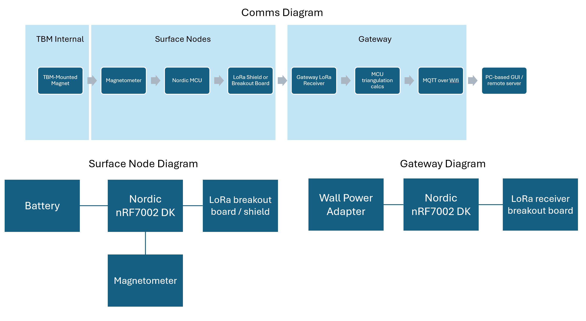

# MagNav: Wireless Underground Guidance


> **Affordable precision navigation for microtunneling.**

---

## Team

| Name | Email |
|------|-------|
| Jefferson Ding | tyding@seas.upenn.edu |
| Sophia Fu | sophiafu@seas.upenn.edu |
| Gabriel Zhang | jgzhang@wharton.upenn.edu |
| Mia Wang | wxm@seas.upenn.edu |

**Course:** ESE5180: IoT Wireless, Security, & Scaling  
**Repository:** [GitHub](https://github.com/ese5180/iot-venture-f25-misogaje)

---

## Table of Contents

- [Overview](#overview)
- [The Problem](#the-problem)
- [Our Solution](#our-solution)
- [System Architecture](#system-architecture)
- [Target Market](#target-market)
- [Stakeholder Validation](#stakeholder-validation)
- [Technical Specifications](#technical-specifications)
- [Project Reflection](#project-reflection)
- [Resources](#resources)

---

## Overview

MagNav is a wireless navigation system for micro tunnel boring machines (TBMs) that provides continuous position and heading data without relying on internal IMUs or vulnerable in-machine electronics. By mounting a strong magnet on the TBM and detecting its field from surface nodes, we eliminate excessive wiring, reduce failure points, and deliver affordable guidance to an underserved market segment.

---

## The Problem

Short microtunneling projects (10–50 m) face a significant guidance gap:

- $100K+ navigation systems are cost-prohibitive for small jobs
- "Eyeball" alignment results in 10–20 cm exit errors
- Internal IMUs suffer from drift, vibration, and water ingress
- No middle-ground solution exists between manual methods and premium systems

This leads to rework, lost labor time, and no digital traceability for contractors and municipalities.

---

## Our Solution

MagNav uses magnetic field triangulation from the surface:

1. **TBM-Mounted Magnet** – A strong N52 neodymium magnet attached to the TBM nose generates a detectable field
2. **Surface Nodes** – Magnetometer-equipped nodes detect the field strength and direction
3. **Gateway Triangulation** – Three or more readings are fused using a dipole solver + Extended Kalman Filter (EKF) to compute position and heading
4. **Cloud Uplink** – Data flows via LoRa → Gateway → Wi-Fi MQTT → operators and remote servers

**Key advantages:**
- No electronics inside the TBM (eliminates water ingress and vibration failures)
- No cables to route through the tunnel
- Testable above ground before deployment
- Target price point: under $5K

---

## System Architecture

### Communication Flow

```
TBM-Mounted     Surface Nodes      Gateway              Cloud
  Magnet    →   Magnetometer  →   LoRa Receiver   →   Wi-Fi MQTT
  (N52)         + Nordic MCU      + Triangulation      + Dashboard
                + LoRa TX         + EKF Solver
```

### System Diagram



### Node Architecture

| Component | Surface Node | Gateway |
|-----------|--------------|---------|
| MCU | Nordic nRF7002 DK | Nordic nRF7002 DK |
| Sensor | MMC5983MA Magnetometer | — |
| Wireless | LoRa (TX) | LoRa (RX) + Wi-Fi |
| Housing | IP65 Enclosure | Weather-resistant |
| Power | Battery | Wall adapter |

---

## Target Market

### Market Sizing

| Segment | Value |
|---------|-------|
| **Global MTBM Equipment Market (2024)** | $1.1–1.5B |
| **Navigation/Guidance Systems** | ~$120–160M/yr |
| **TAM** | $160M (global nav/guidance) |
| **SAM** | $65M (NA + EU) |
| **SOM** | $3.25M (1–5% initial capture) |

*Market growing at >8% CAGR*

### Target Customers

- **Direct users:** Trenchless contractors (HDD, MTBM, pipe jacking), municipal utility owners
- **OEM partners:** Engineering, procurement & construction firms, TBM manufacturers
- **Pilot partners:** Penn Hyperloop (Not-A-Boring Competition)

### Competitive Landscape

| Competitor | Segment | Notes |
|------------|---------|-------|
| VMT (TUnIS Navigation) | Microtunneling | Premium pricing, full-featured |
| Digital Control Inc. (DigiTrak) | HDD | Dominant in walkover locating |
| Underground Magnetics | HDD | Established player |
| Subsite Electronics | HDD | Benchmark for pricing |

**Our differentiator:** Affordable system targeting the underserved $0–$100K gap with no in-tunnel electronics.

---

## Stakeholder Validation

### Cole Kenny, Head of GNC, The Boring Company

We conducted two calls with Cole Kenny to validate our approach and gather feedback.

#### What He Liked

> *"Industry technologies are overkill for small projects. We need an under-5k system that is reliable enough."*

- **Surface-only electronics:** Eliminating failure points inside the TBM aligns with TBC engineering philosophy
- **Novel approach:** No one has commercialized this method before
- **Testable without a tunnel:** Fits lean development and NABC competition rules
- **Strong comms infrastructure:** LoRa + MQTT + encryption + OTA updates already functioning

#### Concerns Raised

- **Magnetic calibration & solver stability:** Dipole inversion + EKF is the hardest part; risk of heading flips and bias drift
- **Steel distortion:** TBM nose will reshape the magnetic field—needs offset modeling
- **Environmental noise:** External ferrous objects, generators, and machinery can introduce interference
- **Operational logistics:** Node placement and leapfrogging during a dig needs clear SOPs

#### His Guidance

1. Lock the communication architecture—shift focus to sensing and solving
2. Prioritize magnetic solver calibration (bias removal, Earth subtraction, weighted fitting)
3. Test with steel fixtures before a real TBM
4. Prepare inspector-ready evidence for NABC

---

## Technical Specifications

### Security Requirements

| ID | Requirement |
|----|-------------|
| SR-01 | All LoRa packets use AES-CCM encryption with per-packet nonce and monotonic counter |
| SR-02 | Gateway authenticates to MQTT broker before publishing |
| SR-03 | Logs are append-only and tamper-evident using hash chaining |

### Hardware Requirements

| ID | Requirement |
|----|-------------|
| HR-01 | TBM magnet (N52, ≥50×20 mm) generates ≥1 μT at 1.5 m depth |
| HR-02 | Surface nodes include nRF7002, LoRa shield, MMC5983MA magnetometer, IP65 housing |
| HR-03 | Gateway is nRF7002 DK with Wi-Fi for MQTT uplink |
| HR-04 | System supports ≥10 nodes at 0.1 Hz update rate |

### Software Requirements

| ID | Requirement |
|----|-------------|
| SRS-01 | Firmware runs Zephyr RTOS on Nordic MCUs |
| SRS-02 | Nodes transmit magnetometer readings at 0.1–1 Hz via LoRa |
| SRS-03 | Gateway fuses ≥3 node readings using dipole solver + EKF |
| SRS-04 | Telemetry published via MQTT in JSON (chainage, easting, northing, elevation, heading) |

### MQTT Telemetry Format

```json
{
  "team": "MagNav",
  "timestamp": 1702598400,
  "mining": true,
  "chainage": 12.5,
  "easting": 100.23,
  "northing": 50.67,
  "elevation": -1.2,
  "roll": 0.01,
  "pitch": -0.02,
  "heading": 1.57,
  "extra": {}
}
```

### Secure Firmware Updates

We use MCUboot as the bootloader with Zephyr RTOS:

- **Bootloader size:** ~43 KB
- **Application size:** ~877 KB
- **Update method:** Wi-Fi (via MQTT infrastructure)
- **Storage:** AWS S3 bucket
- **Rollback protection:** MCUboot automatic rollback if new firmware fails to confirm via `img_mgmt_state_confirm()`

---

## Project Reflection

### What Went Well

**Communications infrastructure exceeded expectations.** We successfully implemented the full LoRa node → gateway → Wi-Fi MQTT pipeline with AES-CCM encryption and OTA update capability. Cole Kenny noted that most NABC teams don't show up with working MQTT. Having this complete early let us focus on the harder sensing problems.

**Stakeholder validation was invaluable.** The two calls with Cole Kenny at The Boring Company gave us real-world feedback that shaped our priorities. His endorsement of the "no electronics inside the TBM" approach confirmed we were solving a real problem in a way that industry practitioners would trust.

**Zephyr RTOS proved to be the right choice.** Despite the learning curve, Zephyr's driver model and MCUboot integration gave us a solid foundation for both the node firmware and secure updates. The Nordic nRF7002 DK's dual Wi-Fi/BLE capability provided flexibility we leveraged for the gateway.

**Modular architecture paid off.** Separating concerns (nodes handle sensing, gateway handles fusion, cloud handles visualization) made debugging easier and allowed parallel development across the team.

### What Didn't Go Well

**Magnetic solver development was underestimated.** The dipole inversion and EKF tuning proved significantly more complex than anticipated. Issues with heading stability, bias drift, and calibration consumed more time than planned. Cole's warning about this being "the hardest part" was accurate.

**Steel distortion testing started too late.** We should have tested with steel fixtures earlier in the development cycle. The magnetic field distortion from ferrous materials is substantial and requires careful modeling. Waiting until later stages compressed our timeline for solver refinement.

**Hardware availability caused delays.** Supply chain issues with some components (particularly magnetometer breakout boards) forced workarounds and slowed initial prototyping. Having backup component options identified earlier would have helped.

### What We'd Change

**Start with the solver, not the comms.** While having robust communications is important, the magnetic triangulation algorithm is the core differentiator. We'd allocate more early-stage time to validating the sensing and fusion approach with bench tests before building out the full wireless stack.

**Build steel test fixtures from day one.** A simple steel pipe or box to simulate TBM field distortion should be part of the initial test setup, not an afterthought. This would surface calibration challenges earlier when there's more time to address them.

**Allocate dedicated time for field testing.** Lab conditions don't capture environmental noise (vehicles, rebar, power lines). We'd budget explicit time for outdoor testing in realistic conditions earlier in the project.

**Consider a simulation-first approach.** Building a MATLAB/Python magnetic field simulator before hardware integration would have let us validate solver algorithms faster and iterate on calibration strategies without waiting for physical test setups.

### System Design Retrospective

**Was LoRa the right choice for node-to-gateway communication?**  
Yes. LoRa's range (sufficient for surface-to-shallow-underground scenarios), low power consumption, and simple point-to-multipoint topology fit our requirements well. BLE would have required more complex mesh networking, and Wi-Fi's power draw would have been prohibitive for battery-powered nodes. The 0.1–1 Hz update rate is well within LoRa's capabilities.

**Would other sensors work better?**  
The MMC5983MA magnetometer was appropriate for our application: high sensitivity, low noise, and good temperature stability. However, adding an IMU to surface nodes for vibration rejection and orientation compensation could improve accuracy in noisy environments. For future iterations, we'd also explore gradiometer configurations (multiple magnetometers per node) to better reject uniform background fields.

**Did our target market want something different?**  
Based on stakeholder feedback, our core value proposition (affordable, no-in-tunnel-electronics navigation) resonates strongly. However, we learned that operational simplicity matters as much as technical performance. Contractors want minimal setup time and clear SOPs for node placement. A future version should prioritize user experience and field-ruggedness alongside accuracy improvements.

**What would we change in the hardware design?**  
- Integrated LoRa + magnetometer boards to reduce node assembly complexity
- More robust weatherproofing (IP67+) for real deployment conditions
- Visual indicators (LEDs) on nodes for field setup confirmation
- Consider solar charging for extended autonomous operation

---

## Resources

### Documentation

- [Financial Model & Power Budget](https://docs.google.com/spreadsheets/d/1R-X6t2DPyomnM5r9wQLkjpDll6tv00gY6B8JL_NzjFE/edit?gid=1607148272#gid=1607148272)
- [CI Pipeline Artifacts](./ci-pipeline-artifacts)

### References

- [Global Micro Tunnel Boring Machine Market Report](https://reports.valuates.com/market-reports/QYRE-Auto-8Z14752/global-micro-tunnel-boring-machine)
- [Nordic nRF7002 DK Documentation](https://www.nordicsemi.com/Products/Development-hardware/nRF7002-DK)
- [Zephyr RTOS](https://zephyrproject.org/)
- [MCUboot](https://www.mcuboot.com/)

---

## License

ESE5180 IoT Venture Project, University of Pennsylvania, Fall 2025

---

<p align="center">
  <strong>Penn Engineering</strong><br>
  School of Engineering and Applied Science
</p>
